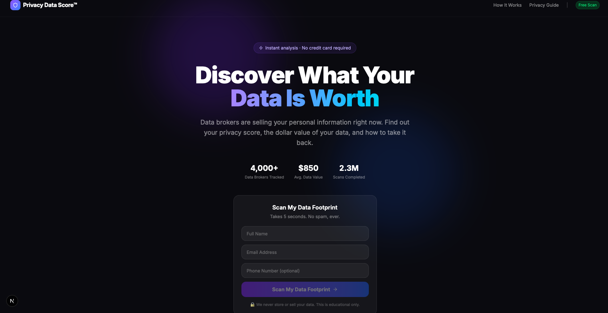
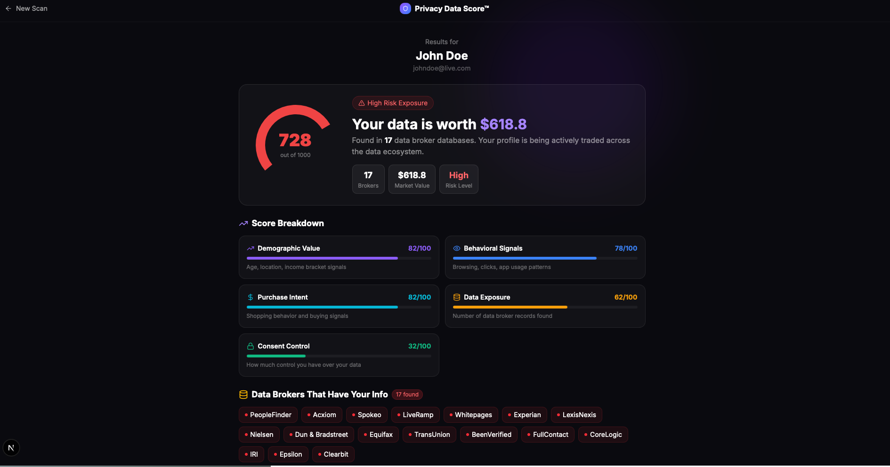
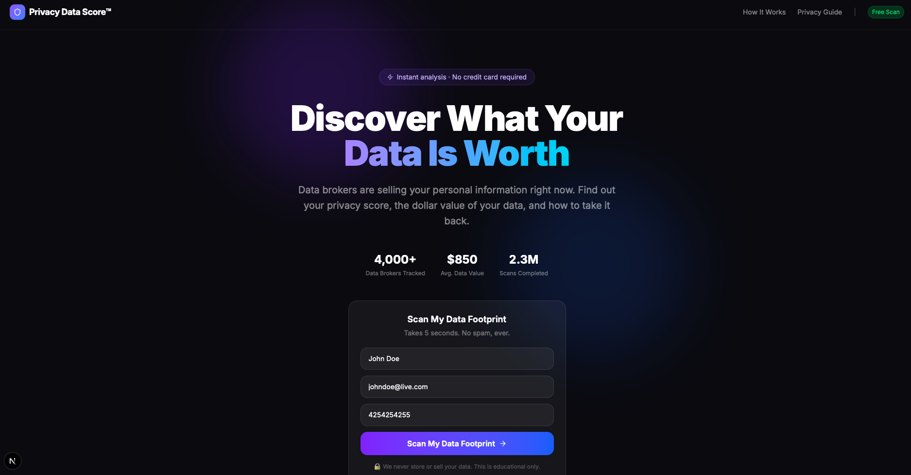

# Privacy Data Score™

> **Discover what your personal data is worth — and take it back.**

Privacy Data Score is a free, instant web tool that analyzes your digital footprint, estimates the market value of your personal data, shows which data brokers are profiling you, and helps you exercise your privacy rights — all in one place.

---

## Screenshots

### Landing Page


### Results Page


### Filled Score View


---

## Why I Built This

Data privacy is invisible to most people — and that invisibility is by design. Brokers profit from information asymmetry. This tool flips that by making your data exposure concrete, quantified, and actionable.

The goal isn't to scare — it's to inform. When people understand that their browsing habits, purchase intent, and demographic profile have a literal dollar value, they start making different choices.

---

## What It Does

Enter your name, email, and optional phone number. In seconds you get:

### Privacy Score & Data Valuation
- A **privacy score out of 1000** based on your estimated data exposure
- A **dollar value** of what your personal data profile is worth on the open market
- A **risk level** (Low / Medium / High) with detailed breakdown

### 11-Dimension Score Breakdown
Your score is built from dimensions that mirror how real data brokers value profiles:

| Dimension | What It Measures |
|---|---|
| Demographic Value | Age, location, income bracket signals |
| Behavioral Signals | Browsing, clicks, app usage patterns |
| Purchase Intent | Shopping behavior and buying signals |
| Data Exposure | Number of data broker records found |
| Consent Control | How much control you have over your data |
| Company Exposure | Number of organizations holding your data |
| Asset Ownership | Home, vehicle, and property ownership signals |
| Investment Exposure | Financial portfolio and investment data signals |
| AI Power User | Tech-savviness and digital tool adoption |
| Age Group Signal | Estimated digital age based on online trail length |
| Phone Type Signal | Prepaid vs postpaid identity linkage |

### Have I Been Pwned Integration
- Live breach lookup via the **HIBP API**
- Shows total breaches, verified, and sensitive exposures
- Lists specific breach sources and exposed data types
- Risk flags for password, financial, and behavioral exposure

### Data Market Profile
Shows exactly **what categories of data are being sold about you**, modeled on practices from Acxiom, Experian, Oracle, LexisNexis, and others:

- Identity & Demographics
- Financial Profile
- Property & Real Estate
- Automotive Profile
- Consumer Behavior
- Digital & Device Footprint
- Health & Wellness (Inferred)
- Political & Civic Profile
- Life Events & Triggers
- Professional & B2B Identity

Each category shows the **likelihood** it's being sold (High / Medium / Low), the specific **attributes** included, and which **broker companies** sell it.

### AI-Powered Insights
- Personalized **key insights** about your exposure profile
- **Recommendations** tailored to your score breakdown
- Powered by the **Claude API (Anthropic)**

### Action Center
- **Opt-out request simulation** — send removal requests to detected data brokers
- **PDF report download** — export your full privacy score report
- **Share score** — copy link to share your results

### Privacy Rights Center
A dedicated page with **47+ companies** across 9 categories, each with a direct link to their Data Subject Rights (DSR) or opt-out page:

| Category | Examples |
|---|---|
| Data Broker | Acxiom, LexisNexis, Epsilon, Oracle Data Cloud |
| Background Check | Spokeo, BeenVerified, Whitepages, TruthFinder |
| Ad Tech | LiveRamp, Criteo, The Trade Desk, Nielsen |
| Big Tech | Google, Meta, Apple, Amazon, Microsoft |
| Financial | Experian, Equifax, TransUnion, Plaid |
| Telecom | AT&T, Verizon, T-Mobile |
| Retail & Commerce | Walmart, Target, Mastercard |
| Health | IQVIA, GoodRx, 23andMe |
| **AI & Machine Learning** | **Anthropic, OpenAI, Google Gemini, Microsoft Copilot, Meta AI, Character.AI, Midjourney, Perplexity, Hugging Face** |

Features include:
- **Opt-out difficulty** rating per company (Easy / Medium / Hard)
- **Rights available** per company (Delete, Access, Correct, Freeze, Opt Out of Training, etc.)
- **Amber tips** highlighting gotchas and known issues
- **Progress tracker** saved in localStorage to track your completion
- **Search and category filters**

---

## Tech Stack

- **Framework:** Next.js 16 (App Router, Turbopack)
- **Language:** TypeScript
- **Styling:** Tailwind CSS
- **UI Components:** shadcn/ui + Lucide Icons
- **Charts:** Recharts
- **PDF Generation:** jsPDF
- **Breach Data:** Have I Been Pwned API (HIBP v3)
- **AI Insights:** Claude API (Anthropic)

---

## Getting Started

```bash
# Clone the repo
git clone https://github.com/rhapsody7712-beep/privacy-data-score.git
cd privacy-data-score

# Install dependencies
npm install

# Set up environment variables
cp .env.example .env.local
# Add your ANTHROPIC_API_KEY and HIBP_API_KEY

# Run the development server
npm run dev
```

Open [http://localhost:3000](http://localhost:3000) in your browser.

### Environment Variables

| Variable | Required | Description |
|---|---|---|
| `ANTHROPIC_API_KEY` | Optional | Enables AI insights on results page |
| `HIBP_API_KEY` | Optional | Enables real breach lookup via Have I Been Pwned |

The app works without both keys — scores use heuristic signals only, and AI insights are skipped gracefully.

---

## How It Works

1. User submits name, email, and optional phone number
2. `/api/score` queries the HIBP API for real breach data, then computes an 11-dimension privacy score using heuristic signals (email domain, breach history, data class weights)
3. `/api/insights` sends the score breakdown to Claude to generate personalized insights and recommendations
4. The results page renders the full profile — score, data valuation, broker list, breach report, data market profile, and AI insights
5. The Privacy Rights Center is a static directory of DSR links with client-side progress tracking

> **Note:** Scores are simulated based on typical data broker behavior patterns and are for educational purposes only. No real data broker database lookups are performed beyond HIBP, and no user data is stored.

---

## Features

| Feature | Status |
|---|---|
| Privacy score (0–1000) | ✅ Live |
| Dollar value estimation | ✅ Live |
| 11-dimension score breakdown | ✅ Live |
| Have I Been Pwned breach report | ✅ Live |
| Data market profile (10 categories) | ✅ Live |
| AI insights + recommendations (Claude) | ✅ Live |
| Data broker exposure list | ✅ Live |
| Opt-out request simulation | ✅ Live |
| PDF report download | ✅ Live |
| Share score link | ✅ Live |
| Privacy Rights Center (47+ companies) | ✅ Live |
| AI company DSR directory | ✅ Live |
| Progress tracker (localStorage) | ✅ Live |

---

## Privacy Promise

This tool practices what it preaches. No user data is stored, logged, or sold. All analysis is performed at request time and discarded immediately after. No third-party trackers. No cookies. The Privacy Rights Center links are informational only — we never proxy or intercept any opt-out requests.

---

## License

MIT — free to use, fork, and build on.

---

*Built to raise awareness about the data economy and give people a starting point for reclaiming their digital privacy.*
